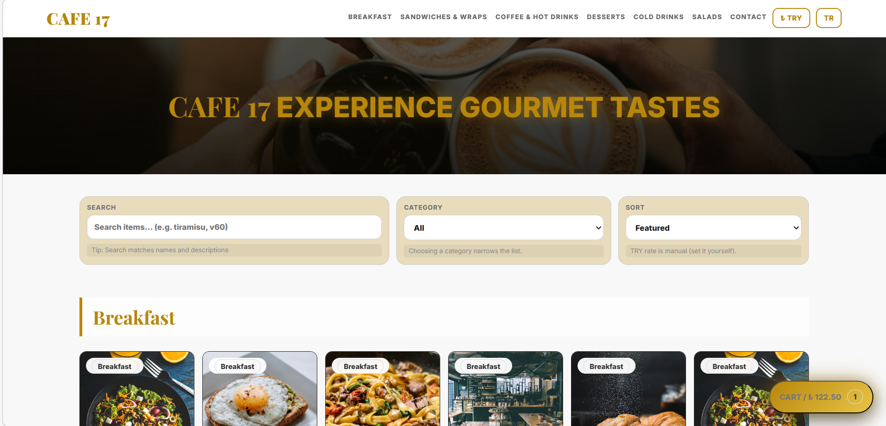

# Cafe17 Website

Modern and responsive cafe menu website built with HTML, CSS, and Vanilla JavaScript.

## Live Demo

https://berfinida.github.io/cafe17_website/

## Features

- Product listing with category sections
- Search, filter, and sort
- Cart management (add, remove, quantity update)
- WhatsApp order message integration
- Language switch (TR / EN)
- Currency switch (EUR / TRY) with manual rate
- Product detail modal
- Responsive layout for mobile and desktop

## Tech Stack

- HTML5
- CSS3
- Vanilla JavaScript

## Screenshot

## Developer

**Berfin Nida Ozturk**  
GitHub: https://github.com/berfinida
